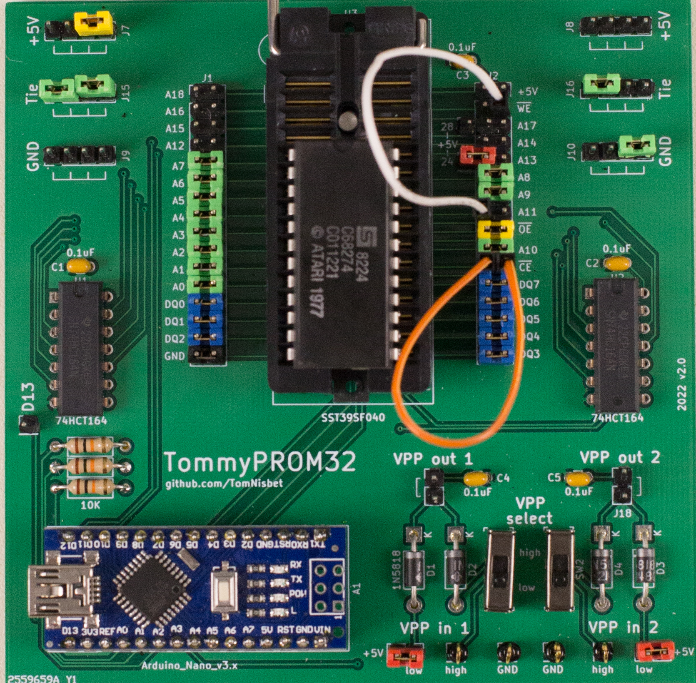
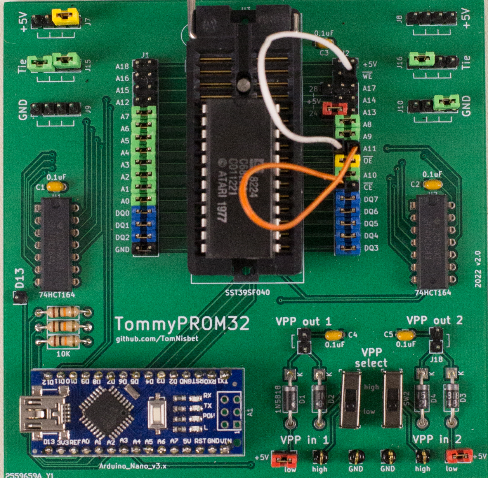
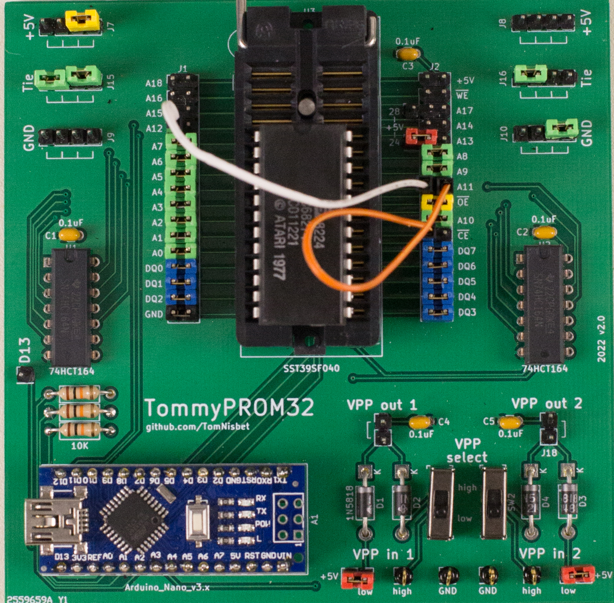

## 2316, 2332, and 2364 Mask-Programmable Read-only Memory

The 2316 is a 2Kx8 mask-programmable ROM made by Commodore.  Intel made a version called the 2316E.  There were also 4K and 8K versions produced as the 2332 and 2364.  These chips were used by a wide variety of computers in the late 1970s and early 1980s, including products from Commodore, Atari, Ohio Scientific, Radio Shack, and others.

## Compatibility with UV EPROMs

The 2316, 2332 and 2364 ROMs are somewhat unique because they have Chip Select signals that are configured when the data is mask-programmed.  Manufacturers could order a 2316 configured with any of its three Chip Select signals as either active-high or active-low.

This causes a bit of confusion, because the datasheets state that the chips are compatible with standard EPROMs, but they should really state that the chips __can be__ compatible, depending on the configuration selected when the chip wass programmed.  For example, a 2316 is only compatible with a 2716 EPROM if the 2316 was manufactured with *CS1* and *CS2* configured active-low and *CS3* configured active-high.  Otherwise, some signals will need to be inverted to swap out a 23 series chip with a more standard EPROM.

Some systems contain multiple 23xx chips with the Chip Selects configured the same and others will configure each chip differently.  For example, the OSI SuperBoard contains five 2316s and they are all configured with the CS1, CS2, and CS3 lines active-high.

On the other hand, some 8K Atari cartridges use two 2332 chips and will invert one of the Chip Selects so that one chip or the other is selected using a single address line with no additional decoding circuitry.  If the chips are removed from the cartridge, they would need different Chip Select values to read their data.

## Reading 23xx chips with TommyPROM

A TommyPROM programmer can read 23xx series ROM chips.  The programmer can be constructed on a breadboard for quick use or the [TommyPROM32 printed circuit board](tommyprom32-pcb) version can be used for a more permanent solution.

The TommyPROM code uses the three signals that normally connect to an EEPROM's CE, OE, and WE pins to drive the Chip Select signals on the ROM.  The Unlock command tries all combinations of the chip select values and scans the ROM to determine the correct Chip Select settings.  The correct signal levels are asserted on the chip select lines after the Unlock command is run, so no wiring changes or inverters are needed to correct for the Chip Select configuration that is burned into the ROM.

|Type |Size |Range    |Pin 20   |Pin 18   |Pin 21  |
|:--- |:---:|:---:    |:---:    |:---:    |:---    |
|2316 |2Kx8 |0000-07FF|CS1 (OE) |CS2 (CE) |CS3 (WE)|
|2332 |4Kx8 |0000-0fFF|CS1 (OE) |A11      |CS2 (WE)|
|2364 |8Kx8 |0000-1fFF|CS1 (OE) |A11      |A12     |


To use TommyPROM with 2316 chips, perform the following steps:

* Connect the Arduino data bus lines (D2..D9) to the ROM data lines.
* Connect the shift register address lines (A0..A10) to the ROM address lines.
* Connect Arduino A2 (WE) to the ROM's CS3 on pin 21.
* Connect Arduino A1 (CE) to the ROM's CS2 on pin 18.
* Connect Arduino A0 (OE) to the ROM's CS1 on pin 20.
* Compile the TommyPROM code with PROM_IS_23 enabled.
* Run the Unlock command to scan for the Chip Select configuration.

The picture below shows the connections for an unknown or 2316 chip.  The orange wire connects the CE line to ROM pin 18.  The yellow jumper connects OE to pin 20.  The white wire connects WE to pin 21.

[](images/TommyPROM32-2316.jpg)

## Unlock Command Examples

When running the TommyPROM software, first use the Unlock command to scan the chip.  This should detect and configure the chip select lines. After the scan is complete, the Dump or Read command can be used to read the ROM data.

The output of the Unlock command can help determine whether the chip being read is a 2316, 2332 or 2364.

When in doubt, use the 2316 connections first.
{: .notice--info}

### 2316

A 2316 chip should only show one unique line of data.  The output below is the unlock of a 3216 from an Atari 2600 game cartridge.  All three chip select are active HIGH: CS3-H CS2-H CS1-H.

```text
TommyPROM 3.7 - 23 series PROM

>u

Writing the unlock code to disable Software Write Protect mode: no unlock needed, scanning chip selects...

Scanning Chip Select combinations starting at address 0000
CS3/WE:L  CS2/CE:L  CS1/OE:L - ff ff ff ff ff ff ff ff ff ff ff ff ff ff ff ff
CS3/WE:L  CS2/CE:L  CS1/OE:H - ff ff ff ff ff ff ff ff ff ff ff ff ff ff ff ff
CS3/WE:L  CS2/CE:H  CS1/OE:L - ff ff ff ff ff ff ff ff ff ff ff ff ff ff ff ff
CS3/WE:L  CS2/CE:H  CS1/OE:H - ff ff ff ff ff ff ff ff ff ff ff ff ff ff ff ff
CS3/WE:H  CS2/CE:L  CS1/OE:L - ff ff ff ff ff ff ff ff ff ff ff ff ff ff ff ff
CS3/WE:H  CS2/CE:L  CS1/OE:H - ff ff ff ff ff ff ff ff ff ff ff ff ff ff ff ff
CS3/WE:H  CS2/CE:H  CS1/OE:L - ff ff ff ff ff ff ff ff ff ff ff ff ff ff ff ff
CS3/WE:H  CS2/CE:H  CS1/OE:H - 78 d8 a2 ff 9a e8 8a 95 8d e8 d0 fb a9 a2 85 02
Setting CS bits to CS3/WE:H  CS2/CE:H  CS1/OE:H
```

Multiple copies of the same data line could indicate that a Chip Select pin is configured as "don't care".  This configuration mode is not explicitly called out in the data sheet, but has been observed in some chips.  It may also indicate a larger ROM that happens to have the same data in two different locations, like a character ROM for a display.

The output below is the unlock of a 3216 from a TRS-80 Model 16.  Data only appears when both CS1 and CS2 are LOW, but the same output appears for both values of CS3, indicating a not-connected or don't-care on that pin: CS3-X CS2-L CS1-L

```text
CS3/WE:L  CS2/CE:L  CS1/OE:L - f3 3e 80 d3 ff 31 00 20 01 ff 07 11 fe ff 21 ff
CS3/WE:L  CS2/CE:L  CS1/OE:H - ff ff ff ff ff ff ff ff ff ff ff ff ff ff ff ff
CS3/WE:L  CS2/CE:H  CS1/OE:L - ff ff ff ff ff ff ff ff ff ff ff ff ff ff ff ff
CS3/WE:L  CS2/CE:H  CS1/OE:H - ff ff ff ff ff ff ff ff ff ff ff ff ff ff ff ff
CS3/WE:H  CS2/CE:L  CS1/OE:L - f3 3e 80 d3 ff 31 00 20 01 ff 07 11 fe ff 21 ff
CS3/WE:H  CS2/CE:L  CS1/OE:H - ff ff ff ff ff ff ff ff ff ff ff ff ff ff ff ff
CS3/WE:H  CS2/CE:H  CS1/OE:L - ff ff ff ff ff ff ff ff ff ff ff ff ff ff ff ff
CS3/WE:H  CS2/CE:H  CS1/OE:H - ff ff ff ff ff ff ff ff ff ff ff ff ff ff ff ff
Setting CS bits to CS3/WE:H  CS2/CE:L  CS1/OE:L
```

### 2332

If two unique lines of data are shown, then the chip is a 2332.  The output below is an unlock of a 2332 used as a Commodore 64 character ROM.  Data is only present when CS3 is HIGH and CS1 is LOW.

```text
CS3/WE:L  CS2/CE:L  CS1/OE:L - ff ff ff ff ff ff ff ff ff ff ff ff ff ff ff ff
CS3/WE:L  CS2/CE:L  CS1/OE:H - ff ff ff ff ff ff ff ff ff ff ff ff ff ff ff ff
CS3/WE:L  CS2/CE:H  CS1/OE:L - ff ff ff ff ff ff ff ff ff ff ff ff ff ff ff ff
CS3/WE:L  CS2/CE:H  CS1/OE:H - ff ff ff ff ff ff ff ff ff ff ff ff ff ff ff ff
CS3/WE:H  CS2/CE:L  CS1/OE:L - 3c 66 6e 6e 60 62 3c 00 18 3c 66 7e 66 66 66 00
CS3/WE:H  CS2/CE:L  CS1/OE:H - ff ff ff ff ff ff ff ff ff ff ff ff ff ff ff ff
CS3/WE:H  CS2/CE:H  CS1/OE:L - 3c 66 6e 6e 60 62 3c 00 00 00 3c 06 3e 66 3e 00
CS3/WE:H  CS2/CE:H  CS1/OE:H - ff ff ff ff ff ff ff ff ff ff ff ff ff ff ff ff
Setting CS bits to CS3/WE:H  CS2/CE:H  CS1/OE:L
```

The two lines of data are different when the CE value changes, indicating that pin 18 is an address line rather than a chip select. Pin 18 needs to be connected to A11 to read the data from the ROM. The CE from the Arduino is left unconnected. This is shown below.

[](images/TommyPROM32-2332.jpg)

### 2364

Four unique data lines indicate a 2364.  The output below is the scan of a 2364 Kernal ROM from a Commodore 64.  Data is present when CS1 is LOW.

```text
CS3/WE:L  CS2/CE:L  CS1/OE:L - 85 56 20 0f bc a5 61 c9 88 90 03 20 d4 ba 20 cc
CS3/WE:L  CS2/CE:L  CS1/OE:H - ff ff ff ff ff ff ff ff ff ff ff ff ff ff ff ff
CS3/WE:L  CS2/CE:H  CS1/OE:L - f0 24 20 65 e9 a4 d5 20 24 ea 88 b1 d1 c8 91 d1
CS3/WE:L  CS2/CE:H  CS1/OE:H - ff ff ff ff ff ff ff ff ff ff ff ff ff ff ff ff
CS3/WE:H  CS2/CE:L  CS1/OE:L - dd 09 02 8d 01 dd 2c 01 dd 70 07 30 f9 a9 40 8d
CS3/WE:H  CS2/CE:L  CS1/OE:H - ff ff ff ff ff ff ff ff ff ff ff ff ff ff ff ff
CS3/WE:H  CS2/CE:H  CS1/OE:L - b2 d0 e7 e6 9e e6 9f a4 9e d0 ec 18 60 20 d0 f7
CS3/WE:H  CS2/CE:H  CS1/OE:H - ff ff ff ff ff ff ff ff ff ff ff ff ff ff ff ff
Setting CS bits to CS3/WE:H  CS2/CE:H  CS1/OE:L
```  

The data varies when either CE or WE changes, indicating that pins 18 and 21 are both address lines.  For the 2364, ROM pin 18 connects to A11 and ROM pin 21 connects to A12.  The CE and WE from the Arduino are left unconnected. This is shown below.

[](images/TommyPROM32-2364.jpg)

## 23xx Chips and Configurations

|Model     |Type |CS3  |CS2  |CS1  |Tested|Notes|
|:---      |:--- |:---:|:---:|:---:|:---:|:--- |
|**Ohio Scientific SuperBoard**|||
|Monitor   |2316 | x   | H   | H   | Y   |
|BASIC1    |2316 | x   | H   | H   | Y   |
|BASIC2    |2316 | x   | H   | H   | Y   |
|BASIC3    |2316 | x   | H   | H   | Y   |
|BASIC4    |2316 | x   | H   | H   | Y   |
|**Compukit UK101**|||
|MONUK02   |2316 | x   | H   | H   | Y   |
|BASUK01   |2316 | x   | H   | H   | Y   |
|BASUK02   |2316 | x   | H   | H   | Y   |
|BASUK03   |2316 | x   | H   | H   | Y   |
|BASUK04   |2316 | x   | H   | H   | Y   |
|**Commodore 64**|||
|901225-01 |2332 | -   | H   | L   | Y   | Character ROM
|901226-01 |2364 | -   | -   | L   | Y   | Basic
|901227-03 |2364 | -   | -   | L   | Y   | Kernal
|**Commodore VIC 20**|||
|901460-03 |2332 | -   | L   | L   | N   | Character ROM
|901486-01 |2364 | -   | -   |     | N   | Basic
|901486-06 |2364 | -   | -   |     | N   | Kernal
|**Commodore 1451**|||
|325302-01 |2364 | -   | -   |     | N   | DOS
|901229-05 |2364 | -   | -   |     | N   | Kernal
|**TRS-80 Model 1**|||
|ROM A     |2364 | -   | -   |     | N|
|ROM B     |2332 | -   |     |     | N|
|**TRS-80 Model 16**|||
|8043216   |2316 | x   | L   | L   | Y| unknown 512 bytes
|**Apple II**|||
|**Atari 400 and 800**|||
|**Atari 2600 Cartridge**|||
|ROM A     |2332 | -   |     |     | N|
|ROM B     |2332 | -   |     |     | N|
|C011221    |2316 | H   | H   | H   | Y| C68274 unknown cartridge


## References

[Commodore 64](https://ist.uwaterloo.ca/~schepers/roms.html)

[VIC 20 Character ROM](https://forum.vcfed.org/index.php?threads/replacing-vic-20-rom-char-901460-03-with-2732-unespected-behavior.80746/)

[2532 vs 2732](https://pinside.com/pinball/forum/topic/are-2532-and-2732-eproms-interchangeable)

[2332 vs 2532](https://wereallgeeks.wordpress.com/2023/04/18/2532_2732_progadapter/)
